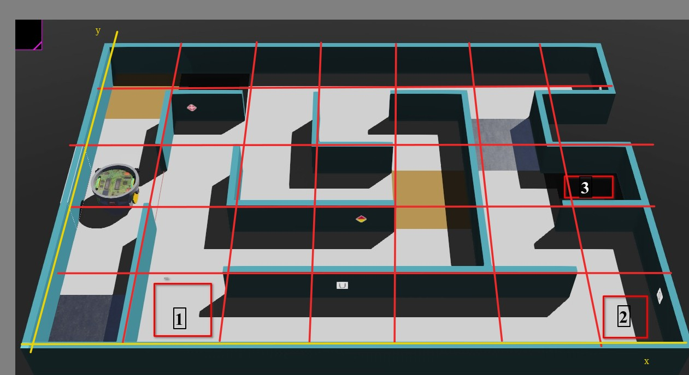

# Ejercicio 3
Hacer que el robot siga el recorrido indicado en la siguiente imagen.

# Tips:
Ver los siguientes ejemplos:

* [GPS](../../Ejemplos/Gps/uso_gps.py)
* [Rotacion](../../Ejemplos/Rotacion/rotacion_usando_encoder.py)
* [Maquina de estados](../../Ejemplos/Maquina_de_estados/maquinas_de_estados.py)
* [Funciones Bloqueantes/noBloqueantes](../../Ejemplos/Funciones_Bloqueantes_NoBloqueantes/funcion_bloqueante_y_no_bloqueante.py)
